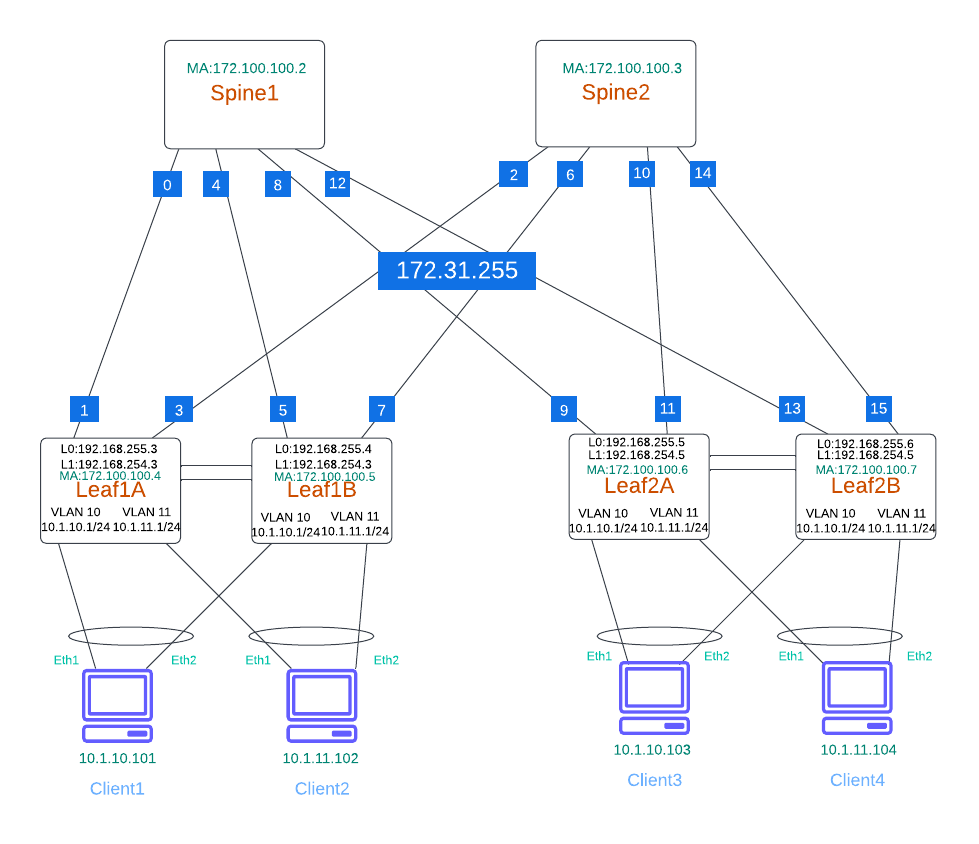

# CDW Immersion Day with Arista cEOS-lab


- [Requirements](#requirements)
- [Lab Setup](#lab-setup)
- [Installation](#installation)
    - [Containerlab](#1-containerlab-installation)
    - [Clone Github Repo](#4-clone-the-arista-avd-github-repository-notechange-to-clone-the-cdw-immersion-day)
- [Lab Pre Tasks](#lab-guide)
    - [Overview](#overview)
    - [Review Files](#1-review-the-lab-files-and-directory-structure-for-the-avd_asym_irb-lab)
    - [Deploy the Lab](#3-next-we-will-build-out-the-network-using-containerlab)
    - [Deploy Configurations](#6-build-the-detailed-spineleaf-configurations)
    - [Configure Alpine Hosts](#9-configure-the-alpine-linux-network-interfaces)
- [Labs](#labs)
    - [Lab 1 Topology](#lab-topology)
    - [Lab 1 - Asymmetric IRB EVPN w/BGP Underlay and Overlay](#lab-1---verify-irb-and-bgp-operations)

### Requirements

- Python 3.6.8 or above
- ansible-core from 2.11.3 to 2.12.x
- arista.avd ansible collection (3.0.0 or above)
- containerlab (0.15 or above)
- arista.avd requirements
- docker
- Arista cEOS-Lab image (4.21.8M or above)
- Alpine-host image

## Lab Setup

### Installation

### 1. Containerlab Installation
Download and install the latest Containerlab release

```shell
bash -c "$(curl -sL https://get.containerlab.dev)"
```
### 2. Verify Containerlab Installation

```shell
$ containerlab version
               _                   _       _     
                 _        (_)                 | |     | |    
 ____ ___  ____ | |_  ____ _ ____   ____  ____| | ____| | _  
/ ___) _ \|  _ \|  _)/ _  | |  _ \ / _  )/ ___) |/ _  | || \ 
( (__| |_|| | | | |_( ( | | | | | ( (/ /| |   | ( ( | | |_) )
\____)___/|_| |_|\___)_||_|_|_| |_|\____)_|   |_|\_||_|____/ 

    version: 0.32.3
     commit: 252304b8
       date: 2022-10-21T15:09:54Z
     source: https://github.com/srl-labs/containerlab
 rel. notes: https://containerlab.dev/rn/0.32/#0323
```
### 4. Clone CDW Arista/Ansible Immersion Day Git Repo (Note:change the link to CDW repo )
```shell
$ git clone https://github.com/rmallory101/arista_avd_labs
NOTE: Change this to the immersion day repo
Cloning into 'avd-cEOS-Lab'...
remote: Enumerating objects: 309, done.
remote: Counting objects: 100% (309/309), done.
remote: Compressing objects: 100% (163/163), done.
remote: Total 309 (delta 169), reused 250 (delta 121), pack-reused 0
Receiving objects: 100% (309/309), 4.57 MiB | 21.15 MiB/s, done.
Resolving deltas: 100% (169/169), done.
```
###################

### 5. Change to the cEOS lab directory
```shell
$ cd avd-cEOS-Lab/
```

### 7. Verify the lab images
The docker images should contain the 3 images used to build the Arista data center architecture. The alpine-host image will be used to build the linux servers. The ceosimage will be used to build the arista switches. The arista_avd_ee image will be used to run the Ansible playbook for configuration of the devices.
```shell
alpine-host                       latest               c19a656094d4   3 weeks ago    72.9MB
ceosimage                         4.29.2F              a507cf2790dd   4 weeks ago    2.04GB
arista_avd_ee                     latest               f88f449637db   4 hours ago    1.39GB
```

## Lab Guide

### Overview

This repository contains ansible playbooks which allow the user to quickly:

1. Deploy cEOS-Lab Leaf Spine topology using [containerlab](https://containerlab.dev/).
2. Configure a Leaf Spine Fabric using Arista and Ansible [AVD](https://avd.sh/en/latest/)
3. Build Linux client PC interface bundles

Note: The same AVD templates can also be used with vEOS-Lab and physical Lab switches with slight changes to lab files.

The assumptions are that the Arista EVPN Spine/Leaf Immersion day GIT repo has been cloned and docker images are available prior to preforming the lab pre-tasks.

### Preform Lab Pre-Tasks

### 1. Review the cloned lab files and directory structure for the avd_asym_irb lab

cd arista_immersion_day_labs/labs/evpn/avd_asym_irb

```shell
$ tree avd_asym_irb
avd_asym_irb
├── ansible.cfg
├── group_vars
│   ├── AVD_LAB.yaml
│   ├── DC1_FABRIC.yaml
│   ├── DC1_LEAFS.yaml
│   ├── DC1_SERVERS.yaml
│   ├── DC1_SPINES.yaml
│   └── DC1_TENANTS_NETWORKS.yaml
├── host_l3_config
│   └── l3_build.sh
├── inventory.yaml
├── playbooks
│   └── fabric-deploy-config.yaml
└── topology.yaml
```

### 2. Take a look at the containerlab topology.yaml file

```shell
[ansible_automation@arista-jumpbox avd_asym_irb]$ cat topology.yaml 
name: avdasymirb

topology:
  kinds:
    ceos:
      startup-config: ../../../ceos_lab_template/ceos.cfg.tpl
      image: ceosimage:4.29.2F
    linux:
      image: alpine-host
  nodes:
    spine1:
      kind: ceos
      mgmt_ipv4: 172.100.100.2
    spine2:
      kind: ceos
      mgmt_ipv4: 172.100.100.3
    leaf1a:
      kind: ceos
      mgmt_ipv4: 172.100.100.4
    leaf1b:
      kind: ceos
      mgmt_ipv4: 172.100.100.5
    leaf2a:
      kind: ceos
      mgmt_ipv4: 172.100.100.6
    leaf2b:
      kind: ceos
      mgmt_ipv4: 172.100.100.7
    client1:
      kind: linux
      mgmt_ipv4: 172.100.100.8
      env:
        TMODE: lacp
    client2:
      kind: linux
      mgmt_ipv4: 172.100.100.9
      env:
        TMODE: lacp
    client3:
      kind: linux
      mgmt_ipv4: 172.100.100.10
      env:
        TMODE: lacp
    client4:
      kind: linux
      mgmt_ipv4: 172.100.100.11
      env:
        TMODE: lacp
  
  links:
    - endpoints: ["leaf1a:eth1", "spine1:eth1"]
    - endpoints: ["leaf1b:eth1", "spine1:eth2"]
    - endpoints: ["leaf2a:eth1", "spine1:eth3"]
    - endpoints: ["leaf2b:eth1", "spine1:eth4"]
    - endpoints: ["leaf1a:eth2", "spine2:eth1"]
    - endpoints: ["leaf1b:eth2", "spine2:eth2"]
    - endpoints: ["leaf2a:eth2", "spine2:eth3"]
    - endpoints: ["leaf2b:eth2", "spine2:eth4"]
    - endpoints: ["leaf1a:eth3", "leaf1b:eth3"]
    - endpoints: ["leaf1a:eth4", "leaf1b:eth4"]
    - endpoints: ["leaf2a:eth3", "leaf2b:eth3"]
    - endpoints: ["leaf2a:eth4", "leaf2b:eth4"]
    - endpoints: ["leaf1a:eth5", "client1:eth1"]
    - endpoints: ["leaf1b:eth5", "client1:eth2"]
    - endpoints: ["leaf1a:eth6", "client2:eth1"]
    - endpoints: ["leaf1b:eth6", "client2:eth2"]
    - endpoints: ["leaf2a:eth5", "client3:eth1"]
    - endpoints: ["leaf2b:eth5", "client3:eth2"]
    - endpoints: ["leaf2a:eth6", "client4:eth1"]
    - endpoints: ["leaf2b:eth6", "client4:eth2"]

mgmt:
  network: ceos_clab                
  ipv4_subnet: 172.100.100.0/24       
  ipv6_subnet: 2001:172:100:100::/80
```

### 3. Next we will build out the network using Containerlab
```shell
$ sudo containerlab deploy -t topology.yaml
INFO[0000] Containerlab v0.32.3 started                 
INFO[0000] Parsing & checking topology file: topology.yaml 
INFO[0000] Creating lab directory: /home/ansible_automation/ansible/avd-cEOS-Lab/labs/evpn/avd_asym_irb/clab-avdasymirb 
INFO[0000] Creating docker network: Name="ceos_clab", IPv4Subnet="172.100.100.0/24", IPv6Subnet="2001:172:100:100::/80", MTU="1500" 
INFO[0000] Creating container: "spine2"                 
INFO[0000] Creating container: "client1"                
INFO[0000] Creating container: "client3"                
INFO[0000] Creating container: "client2"                
INFO[0000] Creating container: "client4"                
INFO[0000] Creating container: "leaf1b"                 
INFO[0000] Creating container: "leaf1a"                 
INFO[0000] Creating container: "leaf2b"                 
INFO[0000] Creating container: "spine1"                 
INFO[0000] Creating container: "leaf2a"                 
INFO[0019] Creating virtual wire: leaf1b:eth2 <--> spine2:eth2 
INFO[0019] Creating virtual wire: leaf1b:eth5 <--> client1:eth2 
INFO[0020] Creating virtual wire: leaf2b:eth2 <--> spine2:eth4 
INFO[0021] Creating virtual wire: leaf2a:eth2 <--> spine2:eth3 
INFO[0021] Creating virtual wire: leaf2a:eth4 <--> leaf2b:eth4 
INFO[0021] Creating virtual wire: leaf2a:eth3 <--> leaf2b:eth3 
INFO[0022] Creating virtual wire: leaf1a:eth2 <--> spine2:eth1 
INFO[0022] Creating virtual wire: leaf1a:eth5 <--> client1:eth1 
INFO[0022] Creating virtual wire: leaf1a:eth4 <--> leaf1b:eth4 
INFO[0022] Creating virtual wire: leaf1a:eth3 <--> leaf1b:eth3 
INFO[0022] Creating virtual wire: leaf2b:eth6 <--> client4:eth2 
INFO[0022] Creating virtual wire: leaf1b:eth1 <--> spine1:eth2 
INFO[0022] Creating virtual wire: leaf2a:eth6 <--> client4:eth1 
INFO[0022] Creating virtual wire: leaf2a:eth1 <--> spine1:eth3 
INFO[0022] Creating virtual wire: leaf2b:eth1 <--> spine1:eth4 
INFO[0022] Creating virtual wire: leaf1a:eth1 <--> spine1:eth1 
INFO[0022] Creating virtual wire: leaf1b:eth6 <--> client2:eth2 
INFO[0022] Creating virtual wire: leaf1a:eth6 <--> client2:eth1 
INFO[0035] Creating virtual wire: leaf2a:eth5 <--> client3:eth1 
INFO[0035] Creating virtual wire: leaf2b:eth5 <--> client3:eth2 
INFO[0039] Running postdeploy actions for Arista cEOS 'spine1' node 
INFO[0039] Running postdeploy actions for Arista cEOS 'leaf2a' node 
INFO[0039] Running postdeploy actions for Arista cEOS 'spine2' node 
INFO[0039] Running postdeploy actions for Arista cEOS 'leaf1b' node 
INFO[0039] Running postdeploy actions for Arista cEOS 'leaf2b' node 
INFO[0039] Running postdeploy actions for Arista cEOS 'leaf1a' node 

INFO[0430] Adding containerlab host entries to /etc/hosts file 
+----+-------------------------+--------------+-------------------+-------+---------+-------------------+------------------------+
| #  |          Name           | Container ID |       Image       | Kind  |  State  |   IPv4 Address    |      IPv6 Address      |
+----+-------------------------+--------------+-------------------+-------+---------+-------------------+------------------------+
|  1 | clab-avdasymirb-client1 | d51494515c74 | alpine-host       | linux | running | 172.100.100.8/24  | 2001:172:100:100::3/80 |
|  2 | clab-avdasymirb-client2 | a41573b633e4 | alpine-host       | linux | running | 172.100.100.9/24  | 2001:172:100:100::9/80 |
|  3 | clab-avdasymirb-client3 | 410721969af5 | alpine-host       | linux | running | 172.100.100.10/24 | 2001:172:100:100::b/80 |
|  4 | clab-avdasymirb-client4 | ff44414e5671 | alpine-host       | linux | running | 172.100.100.11/24 | 2001:172:100:100::7/80 |
|  5 | clab-avdasymirb-leaf1a  | d4de5df380a5 | ceosimage:4.29.2F | ceos  | running | 172.100.100.4/24  | 2001:172:100:100::8/80 |
|  6 | clab-avdasymirb-leaf1b  | 226de12c297b | ceosimage:4.29.2F | ceos  | running | 172.100.100.5/24  | 2001:172:100:100::6/80 |
|  7 | clab-avdasymirb-leaf2a  | b46f7e81bb99 | ceosimage:4.29.2F | ceos  | running | 172.100.100.6/24  | 2001:172:100:100::5/80 |
|  8 | clab-avdasymirb-leaf2b  | 7e93f7a44503 | ceosimage:4.29.2F | ceos  | running | 172.100.100.7/24  | 2001:172:100:100::4/80 |
|  9 | clab-avdasymirb-spine1  | e6107d47a5d1 | ceosimage:4.29.2F | ceos  | running | 172.100.100.2/24  | 2001:172:100:100::a/80 |
| 10 | clab-avdasymirb-spine2  | 7187805105c4 | ceosimage:4.29.2F | ceos  | running | 172.100.100.3/24  | 2001:172:100:100::2/80 |
+----+-------------------------+--------------+-------------------+-------+---------+-------------------+------------------------+
```

### 4. Using Containerlab view the lab network inventory list and IP address information

```shell
$ sudo containerlab inspect -t topology.yaml
INFO[0000] Parsing & checking topology file: topology.yaml 
+----+-------------------------+--------------+-------------------+-------+---------+-------------------+------------------------+
| #  |          Name           | Container ID |       Image       | Kind  |  State  |   IPv4 Address    |      IPv6 Address      |
+----+-------------------------+--------------+-------------------+-------+---------+-------------------+------------------------+
|  1 | clab-avdasymirb-client1 | d51494515c74 | alpine-host       | linux | running | 172.100.100.8/24  | 2001:172:100:100::3/80 |
|  2 | clab-avdasymirb-client2 | a41573b633e4 | alpine-host       | linux | running | 172.100.100.9/24  | 2001:172:100:100::9/80 |
|  3 | clab-avdasymirb-client3 | 410721969af5 | alpine-host       | linux | running | 172.100.100.10/24 | 2001:172:100:100::b/80 |
|  4 | clab-avdasymirb-client4 | ff44414e5671 | alpine-host       | linux | running | 172.100.100.11/24 | 2001:172:100:100::7/80 |
|  5 | clab-avdasymirb-leaf1a  | d4de5df380a5 | ceosimage:4.29.2F | ceos  | running | 172.100.100.4/24  | 2001:172:100:100::8/80 |
|  6 | clab-avdasymirb-leaf1b  | 226de12c297b | ceosimage:4.29.2F | ceos  | running | 172.100.100.5/24  | 2001:172:100:100::6/80 |
|  7 | clab-avdasymirb-leaf2a  | b46f7e81bb99 | ceosimage:4.29.2F | ceos  | running | 172.100.100.6/24  | 2001:172:100:100::5/80 |
|  8 | clab-avdasymirb-leaf2b  | 7e93f7a44503 | ceosimage:4.29.2F | ceos  | running | 172.100.100.7/24  | 2001:172:100:100::4/80 |
|  9 | clab-avdasymirb-spine1  | e6107d47a5d1 | ceosimage:4.29.2F | ceos  | running | 172.100.100.2/24  | 2001:172:100:100::a/80 |
| 10 | clab-avdasymirb-spine2  | 7187805105c4 | ceosimage:4.29.2F | ceos  | running | 172.100.100.3/24  | 2001:172:100:100::2/80 |
+----+-------------------------+--------------+-------------------+-------+---------+-------------------+------------------------+
```

### 5. Login to a Leaf switch and review the initial configuration. Currently the switches have a limited configuration with management IP addressing, API, and username/password.

ssh admin@172.100.100.4
PW: admin


At this point you will see the initial startup configuration which allows Ansible to reach and configure the switches.

```shell
DC1_LEAF1A>enable
show run
management api http-commands
   no shutdown
   !
   vrf MGMT
      no shutdown
interface Management0
   description oob_management
   vrf MGMT
   ip address 172.100.100.4/24
```


### 6. Build the detailed spine/leaf configurations.

Using an Ansible Playbook, "fabric-deploy-config.yaml' we will build and deploy the final configurations for the Arista Leaf/Spine lab.

```shell
[ansible_automation@arista-jumpbox avd_asym_irb]$ ansible-navigator run playbooks/fabric-deploy-config.yaml

PLAY [Build cEOS EVPN Asymmetric IRB Fabric (eBGP Overlay and eBGP Underlay)] ************************************************************

TASK [arista.avd.build_output_folders : Cleanup existing folders in /home/ansible_automation/ansible/avd-cEOS-Lab/labs/evpn/avd_asym_irb/intended] ***
changed: [DC1_SPINE1 -> localhost]

TASK [arista.avd.build_output_folders : Create folder /home/ansible_automation/ansible/avd-cEOS-Lab/labs/evpn/avd_asym_irb/intended] *****
changed: [DC1_SPINE1 -> localhost]

<< Output Ommited >>

PLAY RECAP *******************************************************************************************************************************
DC1_LEAF1A                 : ok=6    changed=5    unreachable=0    failed=0    skipped=1    rescued=0    ignored=0   
DC1_LEAF1B                 : ok=6    changed=5    unreachable=0    failed=0    skipped=1    rescued=0    ignored=0   
DC1_LEAF2A                 : ok=6    changed=5    unreachable=0    failed=0    skipped=1    rescued=0    ignored=0   
DC1_LEAF2B                 : ok=6    changed=5    unreachable=0    failed=0    skipped=1    rescued=0    ignored=0   
DC1_SPINE1                 : ok=28   changed=13   unreachable=0    failed=0    skipped=1    rescued=0    ignored=0   
DC1_SPINE2                 : ok=6    changed=5    unreachable=0    failed=0    skipped=1    rescued=0    ignored=0   
```

### 7. Verify the Fabric. You should see BGP peers from the spine

By logging into one of the network spines you should see the connect EBGP peers (Leaf Switches)

```shell
$ ssh admin@172.100.100.2
Password: 
DC1_SPINE1>ena
DC1_SPINE1#show ip bgp summary 
BGP summary information for VRF default
Router identifier 192.168.255.1, local AS number 65001
Neighbor Status Codes: m - Under maintenance
  Description              Neighbor      V AS           MsgRcvd   MsgSent  InQ OutQ  Up/Down State   PfxRcd PfxAcc
  DC1_LEAF1A_Ethernet1     172.31.255.1  4 65101             19        18    0    0 00:08:42 Estab   3      3
  DC1_LEAF1B_Ethernet1     172.31.255.5  4 65101             18        18    0    0 00:08:44 Estab   3      3
  DC1_LEAF2A_Ethernet1     172.31.255.9  4 65102             18        18    0    0 00:08:39 Estab   3      3
  DC1_LEAF2B_Ethernet1     172.31.255.13 4 65102             18        18    0    0 00:08:34 Estab   3      3
```

### 8. Verify VXLAN and EVPN MAC Learning

By logging into one of the leaf switches you will be able to view the VXLAN status. Note the VLAN to VXLAN mapping in the output below. Also take a look at the source interface. We will discuss this in a future section.

```shell
[ansible_automation@arista-jumpbox avd_asym_irb]$ ssh admin@172.100.100.4
DC1_LEAF1A#show interfaces vxlan 1
Vxlan1 is up, line protocol is up (connected)
  Hardware is Vxlan
  Description: DC1_LEAF1A_VTEP
  Source interface is Loopback1 and is active with 192.168.254.3
  Listening on UDP port 4789
  Replication/Flood Mode is headend with Flood List Source: EVPN
  Remote MAC learning via EVPN
  VNI mapping to VLANs
  Static VLAN to VNI mapping is 
    [110, 10110]      [111, 10111]     
  Note: All Dynamic VLANs used by VCS are internal VLANs.
        Use 'show vxlan vni' for details.
  Static VRF to VNI mapping is not configured
  Headend replication flood vtep list is:
   110 192.168.254.5  
   111 192.168.254.5  
  MLAG Shared Router MAC is 021c.7337.d84b
```

### 8. Verify BGP Peering from a leaf switch.

Note that there are three peers for the IPv4 BGP address family and only two peers for the EVPN BGP address family.
What are the purposes of the extra IPv4 BGP Peer?

<< Output Ommited >>
```shell
DC1_LEAF1A#show ip bgp summary 
BGP summary information for VRF default
Router identifier 192.168.255.3, local AS number 65101
Neighbor Status Codes: m - Under maintenance
  Description              Neighbor     V AS           MsgRcvd   MsgSent  InQ OutQ  Up/Down State   PfxRcd PfxAcc
  DC1_LEAF1B               10.255.251.1 4 65101           1757      1753    0    0    1d00h Estab   7      7
  DC1_SPINE1_Ethernet1     172.31.255.0 4 65001           1754      1754    0    0    1d00h Estab   4      4
  DC1_SPINE2_Ethernet1     172.31.255.2 4 65001           1760      1757    0    0    1d00h Estab   4      4
  
DC1_LEAF1A#show bgp evpn summary 
BGP summary information for VRF default
Router identifier 192.168.255.3, local AS number 65101
Neighbor Status Codes: m - Under maintenance
  Description              Neighbor      V AS           MsgRcvd   MsgSent  InQ OutQ  Up/Down State   PfxRcd PfxAcc
  DC1_SPINE1               192.168.255.1 4 65001           1999      1912    0    0    1d00h Estab   8      8
  DC1_SPINE2               192.168.255.2 4 65001           1990      1950    0    0    1d00h Estab   8      8
DC1_LEAF1A#
```

### 9. Configure the Alpine Linux Network Interfaces
This script will configure the Alpine Linux client with teamed interfaces. This is will allow the use of the MLAG configured on each leaf switch pair.

```shell
cd host_l3_config/
chmod +x l3_build.sh
./l3_build.sh 
[INFO] Configuring clab-avdasymirb-client1
client1
team0.110 Link encap:Ethernet  HWaddr AA:C1:AB:7E:73:19  
          inet addr:10.1.10.101  Bcast:10.1.10.255  Mask:255.255.255.0
          inet6 addr: fe80::a8c1:abff:fe7e:7319/64 Scope:Link
          UP BROADCAST RUNNING MULTICAST  MTU:1500  Metric:1
          RX packets:0 errors:0 dropped:0 overruns:0 frame:0
          TX packets:1 errors:0 dropped:0 overruns:0 carrier:0
          collisions:0 txqueuelen:1000 
          RX bytes:0 (0.0 B)  TX bytes:90 (90.0 B)

Kernel IP routing table
Destination     Gateway         Genmask         Flags Metric Ref    Use Iface
0.0.0.0         172.100.100.1   0.0.0.0         UG    0      0        0 eth0
10.1.0.0        10.1.10.1       255.255.0.0     UG    0      0        0 team0.110
10.1.10.0       0.0.0.0         255.255.255.0   U     0      0        0 team0.110
172.100.100.0   0.0.0.0         255.255.255.0   U     0      0        0 eth0
```

### Lab1 Topology

| Lab | Topology |
| --- | -------- |
| EVPN Asymmetric IRB </br>(eBGP Overlay and eBGP Underlay) </br>(2 Spine + 2 MLAG Leaf Pair + 4 Clients) </br>[`labs/evpn/avd_asym_irb/`] |  |

## Labs

### Lab 1 - Verify IRB and BGP Operations

#### Task 1A. Login to the Alpine Host
```shell
$ docker exec -it clab-avdasymirb-client1  /bin/sh
/ $ 
```

#### Task 1B. Ping from client1 to client2
```shell
$ ping 10.1.10.103
PING 10.1.10.103 (10.1.10.103): 56 data bytes
64 bytes from 10.1.10.103: seq=0 ttl=42 time=20.328 ms
64 bytes from 10.1.10.103: seq=1 ttl=42 time=20.422 ms
64 bytes from 10.1.10.103: seq=2 ttl=42 time=20.763 ms
64 bytes from 10.1.10.103: seq=3 ttl=42 time=17.012 ms
^C
--- 10.1.10.103 ping statistics ---
4 packets transmitted, 4 packets received, 0% packet loss
round-trip min/avg/max = 17.012/19.631/20.763 ms
```

#### Task 1C. View the the mac address of client1 

```shell
$ ifconfig
team0.110 Link encap:Ethernet  HWaddr AA:C1:AB:5A:3B:C9  
          inet addr:10.1.10.101  Bcast:10.1.10.255  Mask:255.255.255.0
          inet6 addr: fe80::a8c1:abff:fe5a:3bc9/64 Scope:Link
          UP BROADCAST RUNNING MULTICAST  MTU:1500  Metric:1
          RX packets:81 errors:0 dropped:0 overruns:0 frame:0
          TX packets:82 errors:0 dropped:0 overruns:0 carrier:0
          collisions:0 txqueuelen:1000 
          RX bytes:4308 (4.2 KiB)  TX bytes:5388 (5.2 KiB)
```

#### Task 1D. Login to Leaf1A and view the evpn vni tables

Remember the VLAN to VXLAN mapping we observed previously? You should see the MAC addresses of two clients mapped to the correct VNI.

```shell
DC1_LEAF1A#show bgp evpn vni 10110
BGP routing table information for VRF default
Router identifier 192.168.255.3, local AS number 65101
Route status codes: * - valid, > - active, S - Stale, E - ECMP head, e - ECMP
                    c - Contributing to ECMP, % - Pending BGP convergence
Origin codes: i - IGP, e - EGP, ? - incomplete
AS Path Attributes: Or-ID - Originator ID, C-LST - Cluster List, LL Nexthop - Link Local Nexthop

          Network                Next Hop              Metric  LocPref Weight  Path
 * >      RD: 192.168.255.3:10110 mac-ip aac1.ab5a.3bc9
                                 -                     -       -       0       i
 * >      RD: 192.168.255.3:10110 mac-ip aac1.ab5a.3bc9 10.1.10.101
                                 -                     -       -       0       i
 * >      RD: 192.168.255.3:10110 imet 192.168.254.3
                                 -                     -       -       0       i
 * >Ec    RD: 192.168.255.5:10110 imet 192.168.254.5
                                 192.168.254.5         -       100     0       65001 65102 i
 *  ec    RD: 192.168.255.5:10110 imet 192.168.254.5
                                 192.168.254.5         -       100     0       65001 65102 i
 * >Ec    RD: 192.168.255.6:10110 imet 192.168.254.5
                                 192.168.254.5         -       100     0       65001 65102 i
 *  ec    RD: 192.168.255.6:10110 imet 192.168.254.5
                                 192.168.254.5         -       100     0       65001 65102 i
DC1_LEAF1A#show bgp evpn vni 10111
BGP routing table information for VRF default
Router identifier 192.168.255.3, local AS number 65101
Route status codes: * - valid, > - active, S - Stale, E - ECMP head, e - ECMP
                    c - Contributing to ECMP, % - Pending BGP convergence
Origin codes: i - IGP, e - EGP, ? - incomplete
AS Path Attributes: Or-ID - Originator ID, C-LST - Cluster List, LL Nexthop - Link Local Nexthop

          Network                Next Hop              Metric  LocPref Weight  Path
 * >      RD: 192.168.255.3:10111 mac-ip aac1.ab8c.f3a4
                                 -                     -       -       0       i
 * >      RD: 192.168.255.3:10111 mac-ip aac1.ab8c.f3a4 10.1.11.102
                                 -                     -       -       0       i
 * >      RD: 192.168.255.3:10111 imet 192.168.254.3
                                 -                     -       -       0       i
 * >Ec    RD: 192.168.255.5:10111 imet 192.168.254.5
                                 192.168.254.5         -       100     0       65001 65102 i
 *  ec    RD: 192.168.255.5:10111 imet 192.168.254.5
                                 192.168.254.5         -       100     0       65001 65102 i
 * >Ec    RD: 192.168.255.6:10111 imet 192.168.254.5
                                 192.168.254.5         -       100     0       65001 65102 i
 *  ec    RD: 192.168.255.6:10111 imet 192.168.254.5
                                 192.168.254.5         -       100     0       65001 65102 i
```

Lab 1 Discussion:
1. What is the purpose of the 192.168.255.3 IP address on Leaf1A?
2. What is the 192.168.255.3 IP addresss actually assigned to?
3. What is the purpose of the Loopback1 interface on each leaf switch?
4. Why do Loopback1 interfaces have the same IP address on each leaf pair?

### Lab 2 - XXXXXX